# IT_Talent_Terraform

Repositório criado para a atividade prática de Terraform do programa ITTalent.

# Hands-On: Instalação do Terraform e criação de .TF para subir um EC2 e um S3

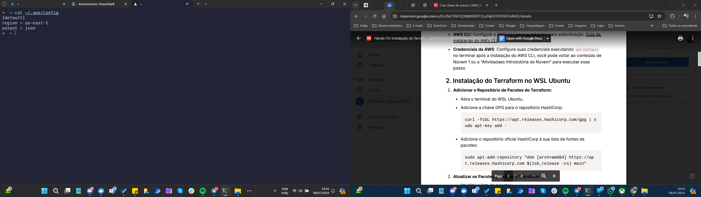
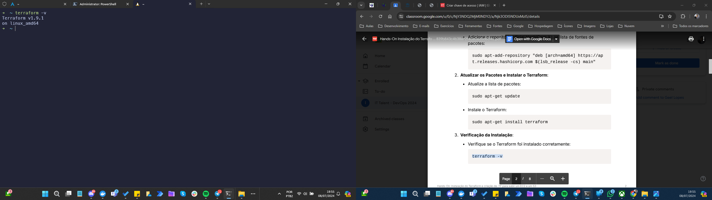
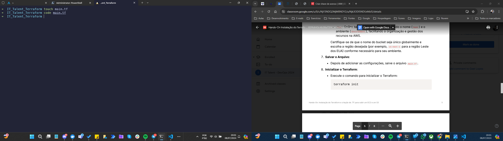
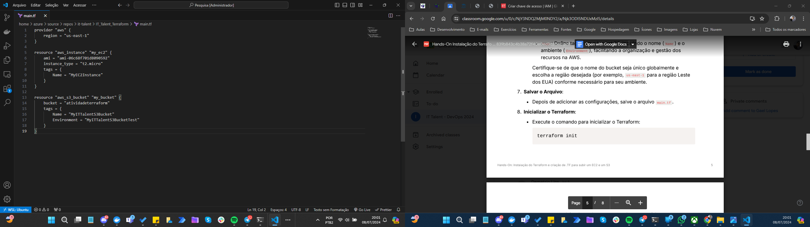
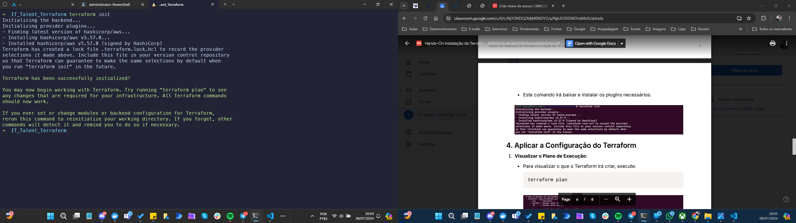
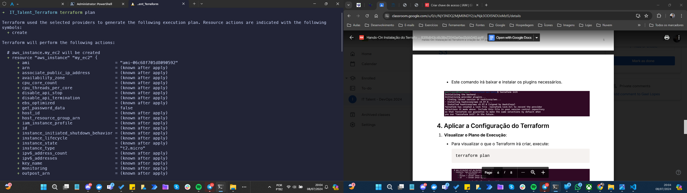
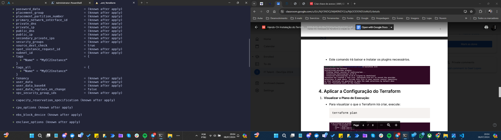
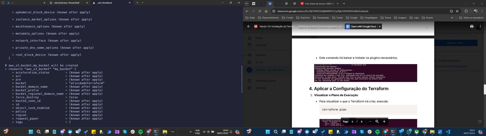
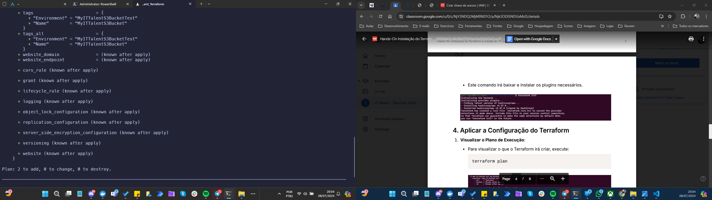
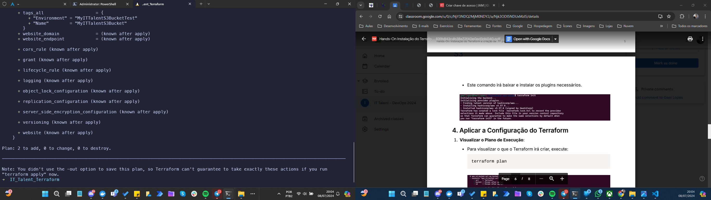
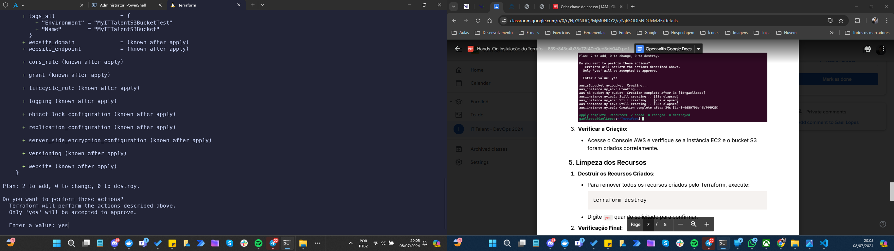
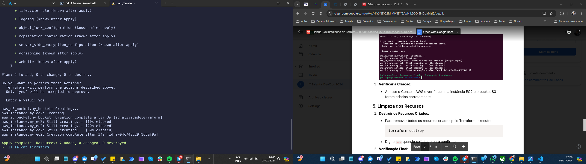
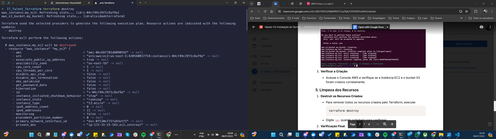
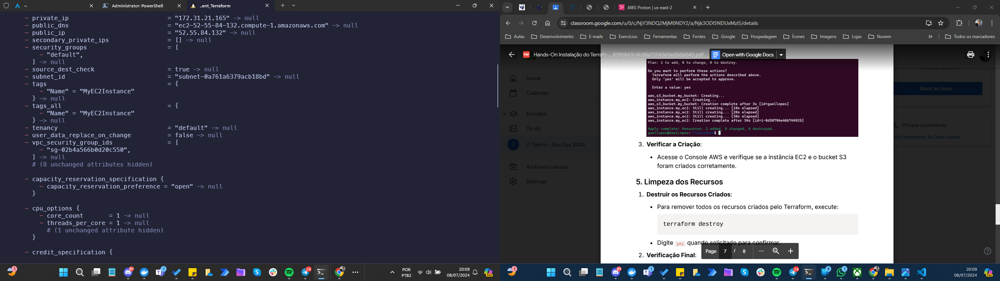

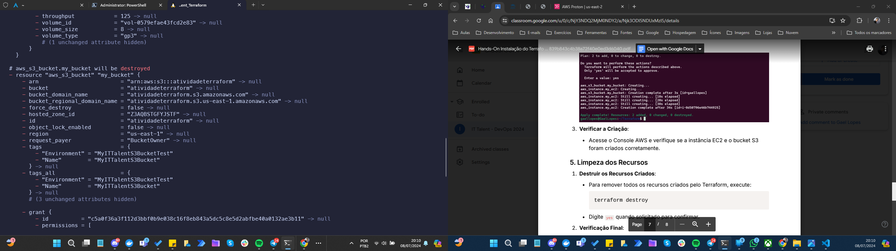
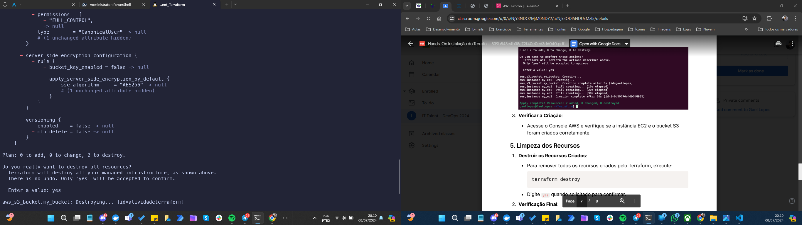
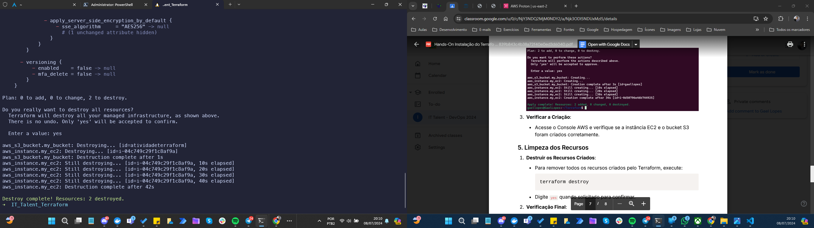
